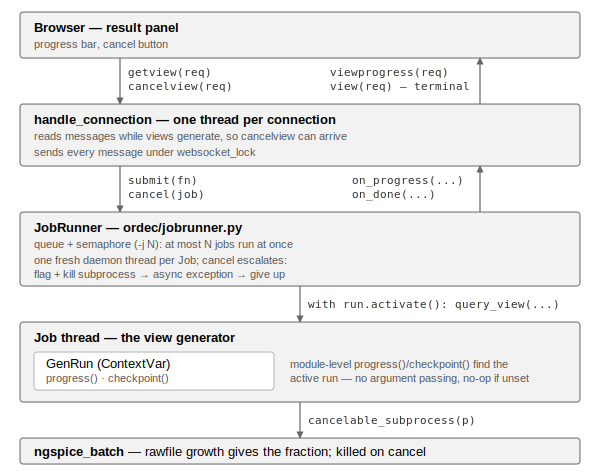

View generation: progress and cancellation
==========================================

Long-running view generators — above all ngspice transient simulations —
report progress to the web interface and can be aborted from it. This page
follows a view request through the pieces involved. The wire protocol itself
is specified in :doc:`webui`, and the API that view generators call is
documented under :ref:`progress-and-cancellation`.

   A view request from the browser to ngspice and back

A connection handler is a plain loop reading messages off one WebSocket. It
does not generate views itself: if it did, it would stop reading for the
duration, and a ``cancelview`` message would go unseen until the generation it
aborts had already finished. Each ``getview`` is instead handed to a job runner
(:mod:`ordec.jobrunner`), which runs it on a thread of its own. That single
constraint shapes the rest: answers no longer come back in request order, so
every request carries an id, and several generators can now run at once, so
their number is bounded by ``-j``.

Before calling the generator, the job thread installs a
:class:`~ordec.core.genrun.GenRun` in a ContextVar. Everything below then finds
the run on its own — ``ngspice_batch`` calls the module-level
:func:`~ordec.core.genrun.progress` without a handle being threaded through the
call chain, and that same call costs nothing outside the server, where no run
is active. Progress travels back out through the handler's ``websocket_lock``,
which already serialises sends from other threads.

Cancellation escalates (see :meth:`ordec.jobrunner.ThreadedJobRunner.cancel`).
Setting the cancel flag makes the generator's next ``progress()`` or
``checkpoint()`` raise, and killing its registered subprocesses unblocks
whatever waits on them — together this covers cooperative generators and
anything sitting in an external tool. A pure-Python loop that never reaches a
checkpoint is interrupted by injecting an asynchronous exception, on CPython.
If neither works, the thread is left running.

Leaving it is deliberate, and the reason is not obvious. A job thread holds
``import_lock.read()`` for the whole generation. Abandoning it as a zombie
would leave ``RWLock._readers`` above zero forever: the next rebuild's
``import_lock.write()`` would block, and since writers take priority, every
later reader queues behind it — the server wedges on the next source edit, long
after the cancellation that caused it. Force-decrementing the count instead
only trades that for a race between the zombie thread and the module purge over
``sys.modules``. So the ladder gives up visibly rather than quietly: the request
is still answered as cancelled, and a warning notes that a rebuild may stall.
Only a loop inside a C extension gets that far, and nothing short of process
isolation would fix that one.
